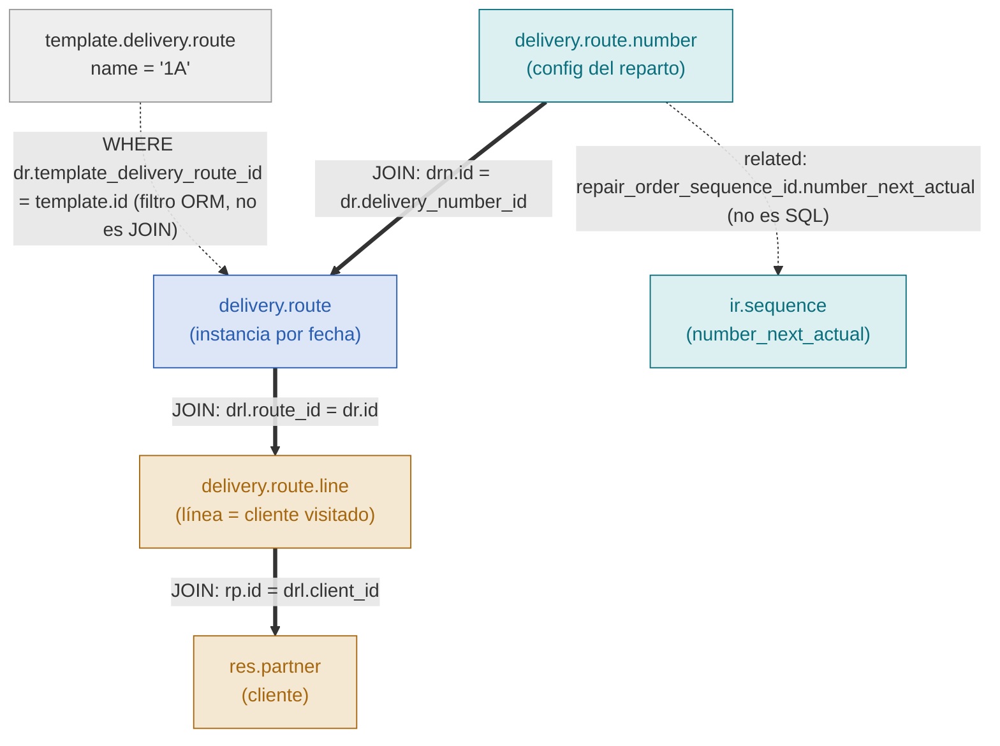

# `get_delivery_and_assigned_route_report` — relación de modelos y flujo de datos

Explica cómo el método de `ivess.delivery.and.assigned.route.report`
(`models/ivess_delivery_and_assigned_route_report.py`) convierte un código de
distribución como `"1A"`, recibido en `kwargs["distribution"]`, en el JSON anidado
que consume el middleware.

---

## 1. Los 5 modelos involucrados

| Modelo | Tabla física | Rol en la consulta | ¿Aparece en el JOIN de la vista SQL? |
|---|---|---|---|
| `template.delivery.route` | `template_delivery_route` | Resuelve el código `"1A"` → un `id`. Se usa solo para **filtrar**. | No — se resuelve antes, por ORM |
| `delivery.route` (`dr`) | `delivery_route` | La ruta concreta (una instancia por fecha de reparto). | Sí — tabla base del `FROM` |
| `delivery.route.number` (`drn`) | `delivery_route_number` | Configuración del reparto (camión, permisos, secuencias). 1 por `dr`, salvo override manual. | Sí |
| `delivery.route.line` (`drl`) | `delivery_route_line` | Una línea = un cliente visitado dentro de una `dr`. Es el **grano** de la vista (`id` de la vista = `drl.id`). | Sí |
| `res.partner` (`rp`) | `res_partner` | El cliente de esa línea. | Sí |

Un 6to actor aparece fuera de la vista SQL: **`ir.sequence`**, resuelto vía un campo
`related` (no SQL) — se explica en la sección 4.

---

## 2. Diagrama de relaciones



Versión en texto (por si el visor no renderiza Mermaid):

```
 template.delivery.route  ("1A")
            │
            │  WHERE dr.template_delivery_route_id = template.id
            │  (filtro por ORM — NO es un JOIN de la vista)
            ▼
 delivery_route_number  ──JOIN──►  delivery_route  ──JOIN──►  delivery_route_line  ──JOIN──►  res_partner
       (drn)         drn.id = dr.delivery_number_id   (dr)   drl.route_id = dr.id    (drl)    rp.id = drl.client_id   (rp)
         │
         │  related: repair_order_sequence_id.number_next_actual  (no es SQL, se resuelve por ORM al leer)
         ▼
   ir.sequence
```

Regla de lectura: **línea sólida/JOIN = está en el `FROM`/`JOIN` de la vista SQL**.
**Línea punteada/related = se resuelve por fuera de la vista**, ya sea antes (búsqueda
del template para filtrar) o después (campo `related` al leer).

---

## 3. Paso a paso: de `"1A"` a la respuesta

1. **Entrada**
   ```python
   kwargs = {"distribution": "1A"}
   ```

2. **Validaciones** (`allowed_params`, `distribution` requerido, debe ser `str`) — si
   fallan, se devuelve un `{"error": ...}` con el mensaje correspondiente.

3. **Resolver la plantilla** — el único punto donde interviene `template.delivery.route`:
   ```python
   template = self.env['template.delivery.route'].search(
       [('name', '=', 'distribution')], limit=1
   )
   ```
   Si no existe, error `"No existe una distribución con el código '1A'."`.
   El resultado (`template.id`) es solo un valor para filtrar — `template.delivery.route`
   nunca se une (JOIN) a la vista SQL.

4. **Buscar sobre la vista SQL**, filtrando por el `id` obtenido:
   ```python
   records = self.search([('template_delivery_route_id', '=', template.id)])
   ```
   Esto genera un `WHERE` sobre la columna `template_delivery_route_id` que la vista
   ya trae copiada desde `dr.template_delivery_route_id` (ver `init()`, la
   `CREATE OR REPLACE VIEW`). Si no hay filas, error `"No hay rutas/clientes
   asignados para la distribución '1A'."`.

   La vista en sí (lo que arma el JOIN real) es:
   ```sql
   FROM delivery_route dr
   JOIN delivery_route_line drl ON drl.route_id = dr.id
   JOIN res_partner rp          ON rp.id = drl.client_id
   JOIN delivery_route_number drn ON drn.id = dr.delivery_number_id
   ```
   Cada fila resultante = **una línea/cliente** (`drl.id`), con sus datos de `dr`, `drn`
   y `rp` ya "aplanados" en la misma fila.

5. **Leer los campos** (`records.read(...)`) separados en tres grupos según a qué
   modelo pertenecen — es la base para el agrupamiento del paso 6:
   - `delivery_number_fields`: 14 campos de `drn` (+ `number_next_actual`, related a `ir.sequence`).
   - `route_fields`: 4 campos de `dr` (`route_id`, `delivery_date`, `state_dr`, `template_delivery_route_id`).
   - `client_fields`: 3 campos de `rp` (`state_rp`, `date_from_rp`, `date_to_rp`) + el `id` de la línea (`drl.id`), que siempre viene incluido por `read()`.

6. **Agrupar en Python** (porque `drn` es 1 por `dr`, y `dr` es 1 por fecha, pero la
   fila plana repite ambos por cada cliente):
   ```python
   delivery_number_id = rec['delivery_number_id'][0]   # agrupa por drn.id
   route_id           = rec['route_id'][0]             # agrupa por dr.id, dentro del drn
   # cada fila restante (client_fields) se apila en clients[]
   ```

7. **Agregar el parámetro de configuración** (independiente de la distribución):
   ```python
   minutos_x_convertir_factura = ir.config_parameter['logistic_custom_ivess.minutos_x_convertir_factura']
   ```

8. **Responder**:
   ```python
   {"settings": {"minutos_x_convertir_factura": ...}, "result": delivery_numbers}
   ```

---

## 4. De dónde sale `number_next_actual` (el caso especial)

`drn.repair_order_sequence_id` es un `Many2one` real hacia `ir.sequence`, y **sí** viaja
en el `SELECT` de la vista SQL (es solo un `id`, una columna más). Pero
`ir.sequence.number_next_actual` **no es una columna** — es un campo `compute` +
`inverse` del core de Odoo (para secuencias `standard`, predice el próximo valor
contra la secuencia nativa de Postgres). Por eso no puede estar en el `SELECT` crudo:
se modela como un campo `related` en el modelo de la vista —

```python
number_next_actual = fields.Integer(
    related='repair_order_sequence_id.number_next_actual',
    readonly=True,
)
```

— y Odoo lo resuelve solo, vía ORM, en el momento de `records.read(...)`.

---

## 5. Mapeo completo: campo → modelo de origen → nivel del JSON

| Campo en la respuesta | Modelo de origen | Columna real | Nivel |
|---|---|---|---|
| `delivery_number_id` | `delivery.route.number` | `drn.id` | `delivery_number` |
| `allow_price_editing` … `allow_reordering` (12 campos) | `delivery.route.number` | `drn.*` | `delivery_number` |
| `number_next_actual` | `ir.sequence` (vía `drn.repair_order_sequence_id`) | *compute, no SQL* | `delivery_number` |
| `route_id` | `delivery.route` | `dr.id` | `route` |
| `delivery_date`, `state_dr`, `template_delivery_route_id` | `delivery.route` | `dr.*` | `route` |
| `id` | `delivery.route.line` | `drl.id` | `client` |
| `state_rp`, `date_from_rp`, `date_to_rp` | `res.partner` | `rp.*` | `client` |
| *(nada — solo filtra)* | `template.delivery.route` | `template.id` | no aparece en el JSON |

---

## 6. Forma final de la respuesta

```json
{
  "settings": { "minutos_x_convertir_factura": 10.0 },
  "result": [
    {
      "delivery_number_id": 5,
      "number": 1,
      "is_cold_hot_delivery": true,
      "number_next_actual": 5,
      "...resto de campos de drn...": "...",
      "routes": [
        {
          "route_id": 38,
          "delivery_date": "2026-06-01",
          "state_dr": "draft",
          "template_delivery_route_id": [1, "1A"],
          "clients": [
            { "id": 62, "state_rp": false, "date_from_rp": false, "date_to_rp": false },
            { "id": 67, "state_rp": "active", "date_from_rp": false, "date_to_rp": false }
          ]
        }
      ]
    }
  ]
}
```
